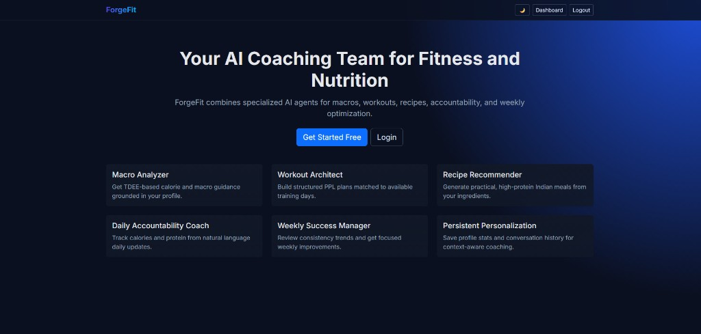
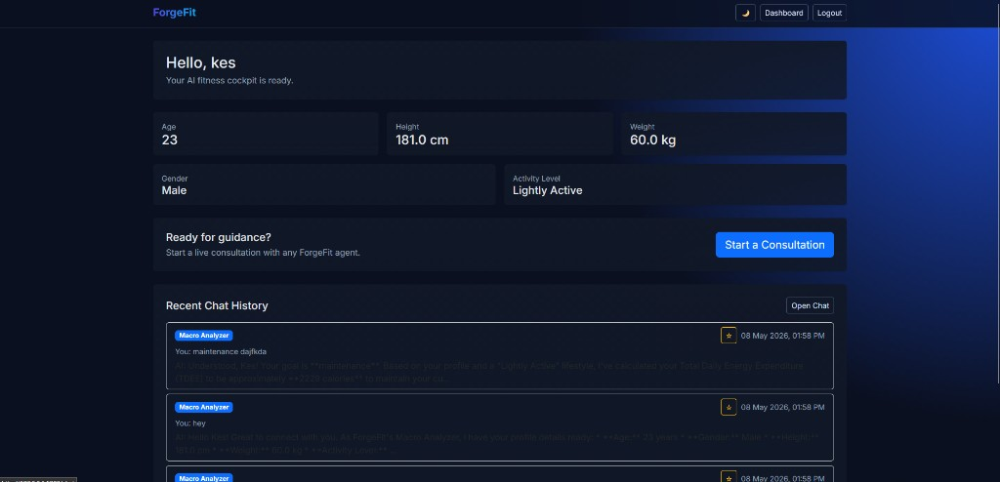
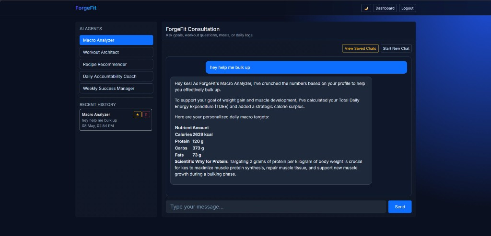

# ForgeFit

ForgeFit is a Flask-based fitness and nutrition app with user authentication, onboarding, and a multi-agent AI chat interface powered by an n8n webhook.

## Tech Stack

- Backend: Flask, Flask-Login, Flask-SQLAlchemy
- Database: SQLite
- Frontend: Jinja2 templates, Bootstrap 5, vanilla JavaScript, marked.js
- AI Orchestration: n8n webhook + Google Gemini workflow

## Core Features

- User registration and login with hashed passwords
- One-time onboarding for profile stats (age, height, weight, gender, activity level)
- Protected dashboard with profile summary and recent chat history
- Agent-based chat interface (Macro, Workout, Recipe, Accountability, Weekly Success)
- Context-aware webhook payloads (profile + recent chat history + prompt)
- Chat history management (favorite/star, delete single item, reset agent chat)
- Light/Dark theme toggle with persistence

## Project Screenshots

### Landing Page



### Dashboard



### Chat Interface



## Project Structure

- `app.py` - Flask routes, auth flow, API endpoints, webhook integration
- `models.py` - SQLAlchemy models (`User`, `ChatMessage`)
- `templates/` - UI templates (`landing`, `login`, `register`, `onboarding`, `dashboard`, `chat`, `base`)
- `requirements.txt` - Python dependencies

## API Endpoints

- `POST /api/chat` - Send prompt to selected agent via n8n and save response
- `GET /api/chat/history?agent_id=<id>` - Fetch chat history for one agent
- `POST /api/chat/history/reset` - Clear chat history for one agent
- `DELETE /api/chat/history/<message_id>` - Delete one chat record

## Local Setup

```bash
cd /mnt/c/workspace/ForgeFit
python3 -m venv .venv
source .venv/bin/activate
pip install -r requirements.txt
python3 app.py
```

App runs at `http://127.0.0.1:5000`.

## n8n Webhook

Configure your n8n workflow to accept ForgeFit payloads and route by `request_type`.

Current webhook URL in app:

- `http://localhost:5678/webhook/forgefit`
